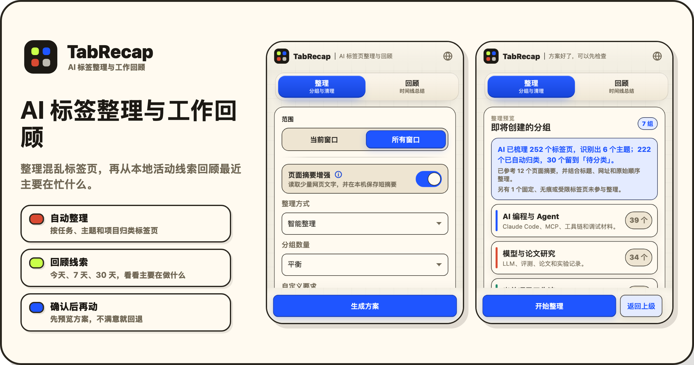

# TabRecap - AI Tab Organizer and Work Recap for Chrome

<p align="center">
  
</p>

<h3 align="center">用 AI 整理混乱标签页，并从本地标签页活动回顾最近在忙什么。</h3>

<p align="center">
  <a href="manifest.json"></a>
  <a href="package.json"></a>
  <a href="worker/README.md"></a>
</p>

TabRecap 是一个 AI 原生的 Chrome MV3 标签页整理与工作回顾扩展。它把打开的标签页交给 LLM 按语义整理，而不是只按域名、标题关键词或手写规则分组。

打开侧边栏后，可以在 **整理** 和 **回顾** 两个页面之间切换。整理会先生成可检查的方案；回顾会先选择时间范围，生成后进入结果页，底部按钮变成“返回上级”。整理和回顾有独立进度，可以并行进行。

English: TabRecap is an AI tab organizer and private work recap extension for Chrome. It groups messy tabs by task, topic, or project, then helps summarize what you worked on from local tab activity and optional page summaries.

<p align="center">
  
</p>

## 为什么做

现有标签页整理工具通常会走两条路：按域名分组，或者套规则。遇到冷门站点、项目内工具、论文、仪表盘、Issue、PR、本地服务和杂乱资料混在一起时，这两种方式都很容易失效。

TabRecap 会把紧凑的标签页信息发给 AI 规划器：

- 标题、域名、精简 URL 信号、窗口、原始顺序；
- 已有浏览器分组、固定标签页、无痕或受限标签页状态；
- 本地活动线索，例如首次看到、最近活跃、打开次数、保留时长和打开/关闭状态；
- 用户显式允许时，附加少量页面可见文字摘要。

AI 只负责给出整理方案、清理建议和回顾内容。真正移动、分组或关闭标签页前，扩展会在本地校验方案；关闭标签页只会发生在你手动点击之后。

## 功能

- **语义分组**：按任务、主题、项目、研究线索或自定义要求整理。
- **跨窗口模式**：可选择把所有符合条件的标签页移动到一个目标窗口后再分组。
- **先预览再整理**：生成后进入预览页，应用前能看到即将创建的分组、待确认页面和清理建议。
- **可回退**：保存操作快照，尽量恢复标签页顺序、分组、固定状态和窗口位置。
- **整理 + 清理一次分析**：默认一次 AI 分析同时生成分组建议和清理检查清单；高级选项里也可以只做其中一项。
- **手动清理**：AI 会标出可能过期、重复或已经完成的标签页，你可以逐个定位或手动关闭，扩展不会自动清理。
- **时间回顾**：按过去 24 小时、本日、本周、本月、最近 7 天、最近 30 天或自定义时间范围，生成文字总结、时间线、主题线索和下次继续建议。
- **按窗口隔离**：每个浏览器窗口都有自己的整理进度、预览和回退状态，不会互相覆盖。
- **停止生成**：整理和回顾都使用统一的底部进度条，长任务可以随时停止生成。
- **自定义 AI 网关**：默认使用内置免费网关；也支持 OpenAI 兼容网关、密钥、自定义模型名和思考强度。
- **多语言结果**：分组名和说明支持自动判断、简体中文或 English。

## 页面内容权限

核心整理能力默认不读取页面正文，只依赖标签页元数据。回顾也可以只基于本地活动、标题、网址和已有分组生成。

需要更准确时，可以手动打开两个增强选项：

- **需要时补读页面摘要**：生成整理方案或回顾前，读取少量网页文字，帮助 AI 理解主题和上下文；高级选项里可以选择读取范围。
- **持续积累页面摘要**：开启后请求网页读取权限，在后台给打开过、未休眠、非无痕页面保存短摘要。之后整理和回顾会优先复用本机摘要，更快也更准。

这两个功能都不会读取密码、表单内容、Cookie、本地存储或完整 HTML。休眠标签页不会被唤醒。

时间回顾不是浏览器历史记录替代品。Chrome MV3 后台会被浏览器挂起，TabRecap 会在被唤醒、标签页更新、窗口切换和定时任务时尽力记录；未授权、休眠、无痕或浏览器限制的页面只能使用标题和网址线索，或者完全跳过。

## 本地安装

```bash
npm install
npm run assets:icons
npm run build:extension
```

然后在 Chrome 中加载：

1. 打开 `chrome://extensions`。
2. 开启 Developer mode。
3. 点击 **Load unpacked**。
4. 选择 `dist/extension`。
5. 点击扩展图标打开右侧侧边栏。

默认只整理当前窗口。“所有窗口”是显式开关，且只有在预览和确认之后才会移动标签页。点击扩展图标会打开右侧侧边栏，不会弹出一个容易丢状态的小窗口。

## AI 网关

AI 网关地址和密钥默认留空，表示使用内置服务。高级设置里可以改成任何兼容 Chat Completions 的网关。

默认模型是 `gpt-5.4`，思考强度为高。也可以在高级设置里切换预设模型：

- `gpt-5.4`
- `gpt-5.5`
- `gpt-5.4-mini`
- `claude-opus-4-8`
- `claude-sonnet-4-6`

也支持自定义模型名。内置服务会放行已验证的文本规划模型；如果使用自己的兼容网关，也可以填写 GLM、DeepSeek 等模型，例如 GLM 可填写 `https://open.bigmodel.cn/api/paas/v4` 和 `glm-5.2`。

不要提交自定义网关密钥。任何出现在聊天、日志、截图、shell history 或测试输出里的密钥都应该轮换。

## 开发

运行单元测试和 Worker 测试：

```bash
npm test
```

运行侧边栏 UI smoke 测试：

```bash
npm run test:ui
```

运行完整发布检查，会清理旧产物、重新生成图标、跑测试、扫描密钥痕迹，并构建本地包和商店包：

```bash
npm run release:check
```

生成 README 图片资源：

```bash
npm run assets:readme
```

构建 Chrome Web Store 风格的安装包：

```bash
npm run build:extension:store
```

输出文件为 `dist/tab-recap-<version>-store.zip`，未打包目录为 `dist/extension-store`；本地调试继续使用 `dist/extension`。

## 压力测试

```bash
npm run build:extension
npm run stress:extension
```

压力测试会启动隔离 Chromium profile，跨多个普通窗口打开数百个生成页面，然后验证：

- 当前窗口整理；
- 所有窗口合并到一个窗口；
- 应用和回退；
- 页面摘要权限边界；
- 对可访问 live 页面读取短摘要。

可选真实网关压力测试：

```bash
GATEWAY_BASE_URL=http://127.0.0.1:8317/v1 STRESS_GATEWAY_TABS=60 npm run stress:extension
```

## 架构

```text
Chrome tabs/windows
        |
        v
标签页清单 + URL 脱敏 + 原始顺序
        |
        v
可选缓存/页面短摘要信号
        |
        v
本机活动记录和时间回顾
        |
        v
AI 网关规划器
        |
        v
本地校验 + 预览
        |
        v
Chrome 执行器 + 回退快照
```

## 设计文档

- [文档索引](docs/README.md)
- [基准与决策记录](docs/benchmarks/README.md)
- [Gateway Worker](worker/README.md)
